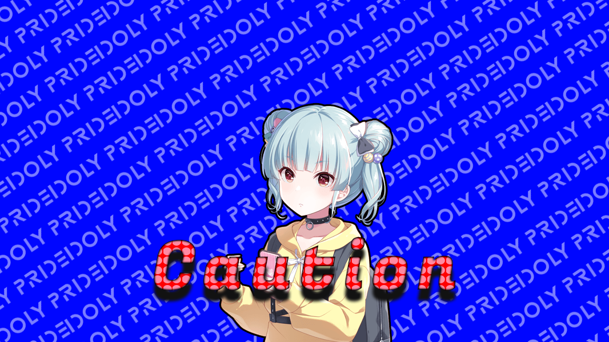

# 'Idoly Pride' Goods shop

<!--배지-->
![MIT License][license-shield] ![Repository Size][repository-size-shield] ![Issue Closed][issue-closed-shield]

<!--프로젝트 대문 이미지-->


<!--프로젝트 버튼-->
 [![Readme in English][readme-eng-shield]][readme-eng-url]

 <!--목차-->
# 목차
- [[1] About the Project](#1-about-the-project)
  - [Features](#features)
  - [Technologies](#technologies)
- [[2] Getting Started](#2-getting-started)
  - [Prerequisites](#prerequisites)
  - [Installation](#installation)
  - [Caution](#caution)
- [[3] Usage](#3-usage)
- [[4] Contact](#4-contact)

# [1] About the Project
- 해당 프로젝트는 ***'Idoly Pride'*** 게임의 굿즈 판매 사이트이며, 로그인/회원가입 부터 상점, 커뮤니티 등의 기능을 포함합니다.
- 쇼핑몰 사이트의 구조 구현 연습 및 애니메이션 구현 연습에 중점을 둔 프로젝트 입니다.
- 해당 프로젝트는 최종 버전 이전까지 지속적인 업데이트를 진행되어 **90일간** 배포 될 예정입니다.
- 업데이트 내역은 본 문서 하단 **Update Note** 부분을 참고 하시길 바랍니다.

## Features
- 다양한 **애니메이션**이 구현되어 있습니다.
- **필터 검색** 기능을 포함하고 있으며, 다중 조건 검색이 가능합니다.
- **시그니처 컬러**를 이용한 디자인을 통해 색상의 난잡함을 줄였습니다.

## Technologies
- [PHP]
- [Maria DB - PHPMyAdmin]
- [HTML5], [CSS3], [JAVASCRIPT]
- [Adobe Photoshop 2023], [Adobe XD]
- [Visual Studio Code]

# [2] Getting Started
- 해당 프로젝트는 **PHP**로 개발되었습니다. 때문에 **XAMMP** 프로그램을 다운받아 사용하시길 바랍니다.
- 정상적인 작동을 위해 **PHP My Admin**에 geet 데이터베이스를 만들어 폴더 내 **geet.sql**을 import하시길 바랍니다.

## Prerequisites
*XAMMP의 다운로드 방법은 아래와 같습니다.*

- **XAMMP 다운로드**: https://www.apachefriends.org/
- **XAMMP 다운로드 시 주의사항**: Apache, MariaDB(PHP MY Admin), PHP 세가지만 다운로드 받으면 됩니다.

## Installation
*프로젝트의 소스코드는 Repository 클론을 사용하시거나 zip파일로 다운로드 받아 사용하시길 바랍니다.*
1. Repository 클론
```bash
git clone https://github.com/your-username/project-repository (https://github.com/jejuKIM99/Goods_Shop.git)
```
2. zip파일로 다운로드
```bash
https://github.com/jejuKIM99/Goods_Shop
```

## Caution



- *해당 프로젝트는 현재 개발중입니다. 이것을 감안하여 참고 바랍니다.*
- **해당 프로젝트의 허용 범위 외 사용과 배포는 금지되어 있습니다. 사용 희망 시 본 문서 아래 이메일로 문의 바랍니다.**
- **허용 범위**: *개인 학습 및 참고*
- **금지**: ***개인 포트폴리오 사용, 영리목적 사용, 강의용 자료, 재가공 및 배포*** 등 허용 범위 외 사용

# [3] Usage

<h2>Index Page</h2>


- **Index Page**입니다. 해당 페이지는 페이지 초기 로드시 나타나며, 간단한 애니메이션을 포함하고 있습니다.
- 배경 및 이미지는 **Idoly Pride**의 공식홈페이지에서 다운로드 하였습니다.

```javascript
document.addEventListener('DOMContentLoaded', function() {
    const blueBackground = document.querySelector('.blue-background');
    const mainVisual = document.querySelector('.main-visual');
    const textContent = document.querySelector('.text-content');

    // 애니메이션 시작
    setTimeout(() => {
        blueBackground.style.width = '100%'; // 배경 넓이 애니메이션
        mainVisual.style.width = '50%'; // 메인 비주얼 넓이 애니메이션
        textContent.style.left = '50%'; // 텍스트 위치 이동 애니메이션
    }, 100); // 0.1초 뒤 애니메이션 시작

    // 텍스트 애니메이션 시작
    setTimeout(() => {
        textContent.style.opacity = 1; // 텍스트 서서히 보이기
    }, 500); // 0.5초 뒤 애니메이션 시작
});

```
- 애니메이션 코드는 위와 같습니다.
- 해당 코드는 **script.js** 파일에서 확인 가능합니다.

<h2>Main Page</h2>


- **Main Page**입니다. **Index Page**에서 버튼을 눌러 진입하면 보시게 될 페이지 입니다.
- 해당 페이지는 상단 메뉴바 **nav.php**를 포함하고 있으며, 각각의 구역으로 나누어 구성되어 있습니다.
- 페이지 내용영역 상단 슬라이드 부분에 조금의 오류가 있습니다.
- 페이지의 내용은 추후 업데이트를 통해 동적으로 구성될 예정입니다.

<h2>Mypage</h2>


- **MyPage**입니다. **nav**의 로그인 버튼을 눌러 로그인 성공 이후 진입 가능한 페이지 입니다.
- 해당 페이지에서 프로필 사진 변경 및 비밀번호 변경이 가능합니다. *(비밀번호 변경 기능 미구현)*
- 해당 계정의 구매목록을 볼 수 있으며, 간단한 필터 정렬기능을 포함합니다.
- **진입방법**: ID: admin@naver.com, PW: 111111 로 구매 이력이 있는 계정으로 진입 가능합니다.

<h2>Shop Page & Community Page</h2>


- **Shop Page와 Community Page**입니다. 해당 페이지는 로그인을 하지 않아도 진입 가능합니다.
- **SideBar**를 통해 **Shop Page**내에서 검색 및 정렬이 가능합니다.
- 검색 및 정렬은 다중 조건을 허용하며, 검색 결과 일치 항목이 없을 경우에 대한 처리도 되어 있습니다.
- **Community Page**에는 검색기능이 있으며, 추후 글쓰기 및 필터 정렬 기능을 추가 할 예정입니다.

# [4] Contact
- 📧 s2005i@naver.com
- 📋 [https://github.com/jejuKIM99/Goods_Shop]


<!--Url for Badges-->
[license-shield]: https://img.shields.io/github/license/dev-ujin/readme-template?labelColor=D8D8D8&color=04B4AE
[repository-size-shield]: https://img.shields.io/github/repo-size/dev-ujin/readme-template?labelColor=D8D8D8&color=BE81F7
[issue-closed-shield]: https://img.shields.io/github/issues-closed/dev-ujin/readme-template?labelColor=D8D8D8&color=FE9A2E

<!--Url for Buttons-->
[readme-eng-shield]: https://img.shields.io/badge/-readme%20in%20english-2E2E2E?style=for-the-badge

<!--URLS-->
[readme-eng-url]: ../README.md
